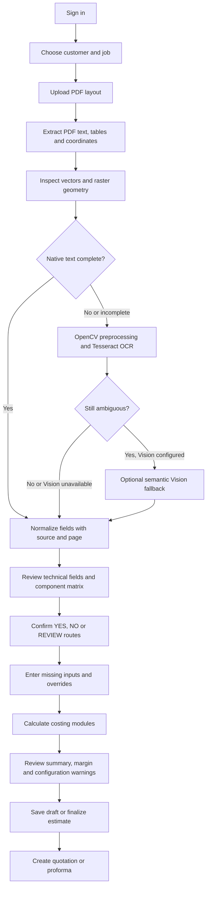

# Pacfully Project Process Data

**Record date:** 2026-10-06  
**Scope:** End-to-end estimate workflow and the Kakada Premium Sweet Box PDF validation  
**Status:** PDF extraction and browser-to-cost-summary flow verified; several business inputs still need confirmation before the estimate is quote-ready.

## 1. Project Flow



## 2. Extraction Pipeline

1. **PDF upload:** The UI sends PDF files to `POST /api/layout/extract`. PNG/JPG uploads remain available for manual component entry; the automatic extraction endpoint is for PDFs.
2. **PyMuPDF primary pass:** Read native text in PDF order, search text coordinates, detect tables and vector drawing paths. Table cells are used as a fallback when native reading order cannot identify a component; fragmented drawing-grid cells do not replace already-parsed native text.
3. **OpenCV geometry pass:** Render each page at reduced scale and report edge pixels, contours, detected lines, native vector paths and embedded raster-image counts. This is geometry evidence; it does not infer missing process choices or assign dimensions to components without a reliable text relationship.
4. **OCR fallback:** When native text is missing or incomplete, render and preprocess the page with OpenCV and use Tesseract. Low-confidence OCR results remain confirmation-required and do not activate costing routes.
5. **Optional Vision fallback:** Only after native text, table parsing and OCR cannot resolve a component page. Configure `GEMINI_API_KEY` to enable it. Vision-derived process values remain confirmation-required and do not automatically route into costing.
6. **Normalization and provenance:** Extracted fields retain the PDF value, normalized value where safe, confidence, source, page, bounding box when available, and review status. Missing values are not synthesized.
7. **Central matrix:** `true` means YES and creates a costing row, `false` means NO and creates none, and `null` means REVIEW / confirmation required and creates none until the user confirms it.
8. **Costing:** Component-specific technical values are passed through the existing component process inputs. Rates continue to follow Master → Override → Effective → Formula. Existing costing formulas were not changed.

## 3. Kakada PDF Record

**PDF:** `Kakada_Ramprasad_Premium Sweets_kappa_Ups Plan.pdf`  
**Extraction source:** PyMuPDF native text  
**Pages:** 5  
**Components:** 4  
**Drawing dimensions:** 18 explicit millimetre labels on page 5

### Project fields

| Field | Extracted value | Source / review |
|---|---|---|
| Project | Kakada premium sweet box | Page 5; review required |
| Customer / Brand | Kakada | Page 5; review required |
| Product | sweet box | Page 5; review required |
| Box type | Top and bottom | Page 5; review required |
| Finished box size | 208x148x36mm | Page 5; normalized to 208 × 148 × 36 mm |
| Quantity | 5000 qty | Page 5; normalized to 5,000 |
| Revision | `-` | Page 5; confirmation required |
| Drawing version | v1 | Page 5; review required |
| Prepared date | 06.10.2026 | Page 5; review required |

### Component specifications and explicit processes

| Component | Material | Sheet size | Thickness | GSM / GSM per 1 mm | UPS | Printing | Lamination | Punching |
|---|---|---|---|---|---|---|---|---|
| Top-KAPPA-01 (p.1) | White Back Kappa Board | 31 × 20.5 in | 1.5 mm | 750 per 1 mm | 6 | NO | NO | YES |
| Bottom-KAPPA-02 (p.2) | White Back Kappa Board | 31 × 20.5 in | 1.5 mm | 750 per 1 mm | 5 | NO | NO | YES |
| WR-01 (p.3) | Art Paper | 20 × 28 in | Not stated | 128 GSM | 2 sets, top and bottom | YES | YES / matt | YES |
| INS-DUPLEX-01 (p.4) | Duplex | 30 × 20; unit not stated | Not stated | 230 GSM | 2 set ups | NO | YES / glass | YES |

Native-text fields have a 99% extraction confidence marker; treat it as an extraction heuristic, not a calibrated model probability. Field-level source page and review status are included in the API result and displayed in Technical Data Review. The 18 page-5 dimension labels are retained in the order read from the PDF:

```text
208, 148, 36, 212.4, 152.9, 22, 256.75, 197.25, 318.75,
258.25, 295.15, 235.15, 348.55, 287.55, 206.28, 75.35,
206.28, 75.35 mm
```

These drawing measurements are not automatically assigned to component sheet sizes unless the PDF provides an explicit, reliable relationship.

## 4. Matrix and Costing Outcome

Only explicit PDF YES/NO values are assigned automatically. The current matrix for this document is:

- Top-KAPPA-01: Punching YES; Lamination NO; Printing NO. Other processes remain REVIEW.
- Bottom-KAPPA-02: Punching YES; Lamination NO; Printing NO. Other processes remain REVIEW.
- WR-01: Punching YES; Lamination YES; Printing YES. Wrapper itself is not specified and remains REVIEW.
- INS-DUPLEX-01: Punching YES; Lamination YES; Printing NO. Other processes remain REVIEW.

After the Kappa material-name mapping was added, the live browser calculation created three Punching rows: Top-KAPPA-01, Bottom-KAPPA-02 and INS-DUPLEX-01. With the active local costing configuration, that preview showed ₹15,600 total and ₹3.12 per box for 5,000 boxes. This is a provisional calculation, not an approved quotation.

The summary also reports `Lamination`, `Printing` and `Punching` as configuration-required. WR-01 is explicitly marked for Printing, Lamination and Punching, but its Wrapper route is not stated; those operations need Wrapper final sheets. No Base Material YES appears in the PDF, so no Kappa Base Material row is created. This is deliberate: component identity or material type does not imply a process route.

## 5. Confirm Before Quoting

1. Confirm whether Top-KAPPA-01 and Bottom-KAPPA-02 require the Base Material process. Their material specifications are extracted, but the PDF does not mark that process YES.
2. Confirm whether WR-01 should be routed through Wrapper. Its component ID and sheet specifications do not replace an explicit process decision.
3. Confirm the unit for INS-DUPLEX-01 sheet size `30 × 20`.
4. Confirm what `glass` means for INS-DUPLEX-01 lamination. The raw text is preserved; it is not silently converted to Gloss.
5. Confirm the printing method and colour configuration. The PDF states Printing YES but does not specify Offset/Digital or colour count.
6. Confirm the lamination method. `matt` is normalized as Matte for WR-01; the method is absent. The Duplex finish remains unresolved.
7. Confirm all unlisted process columns, including Foiling, Spot UV, Drip-Off and Embossing. They remain REVIEW, not NO.
8. Review master rates and any estimate overrides before treating the displayed costing preview as final.

## 6. UI Steps and Data Synchronization

1. **Layout & Component Extraction:** Select customer/job and upload the PDF. Extracted components populate the editable central matrix.
2. **Technical Data:** Review project fields, quantity, component specifications, source page, confidence and confirmation-required values. The extracted quantity updates the estimate quantity.
3. **Costing Modules:** Review module fields and component-specific overrides. A confirmed YES route exposes the corresponding process inputs. Dependent Printing, Lamination and Wrapper-material Punching require current Wrapper final sheets.
4. **Summary & Margin:** Review module rows, configuration warnings, manufacturing cost, margin, selling price and order value. Editing a process matrix route recalculates against the same component list.
5. **Quotation / Proforma:** Save or finalize only after required process and technical confirmations. Saved estimates retain the extraction fields and component matrix in the input snapshot.

## 7. OCR and Configuration Notes

- Local Tesseract OCR was tested using a rasterized copy of a Kakada component page. It identified the component at 73.4% confidence; process routes remained REVIEW because confidence was below the automatic routing threshold.
- Set `TESSERACT_CMD` when the executable is not on PATH. Render installs the executable from `backend/apt.txt`.
- Gemini Vision is optional. No Gemini key was configured during this validation, so the Vision HTTP integration was not exercised against the provider.
- Image uploads (PNG/JPG/JPEG) still require manual component and process entry; PDF raster pages can use the OCR fallback.

## 8. Verification Record

Validated on 2026-10-06:

- `38 passed` across the backend test suite, including native text, table-cell fallback, vector/raster geometry, OCR/Vision ordering, normalization, process routing and Kakada upload-to-calculation integration.
- `npm run build` completed successfully for the frontend.
- Browser smoke test uploaded the Kakada PDF, displayed four matrix rows and source-attributed technical data, calculated the three confirmed Punching rows, and showed the expected configuration warning.
- FastAPI extraction returned HTTP 200, 4 components, 18 dimensions, quantity 5,000 and `vision_status: not_configured`.

## 9. Run Locally

PowerShell, from the repository root:

```powershell
Push-Location backend
.\.venv\Scripts\python.exe -m uvicorn app:app --host 127.0.0.1 --port 8000
```

In a second terminal:

```powershell
Push-Location frontend
npm run dev
```

Run the backend tests and frontend build:

```powershell
.\backend\.venv\Scripts\python.exe -m pytest .\tests -q
Push-Location frontend
npm run build
Pop-Location
```

The verified local UI was served at `http://localhost:5173/estimator`; the API health route is `http://127.0.0.1:8000/api/health`.
