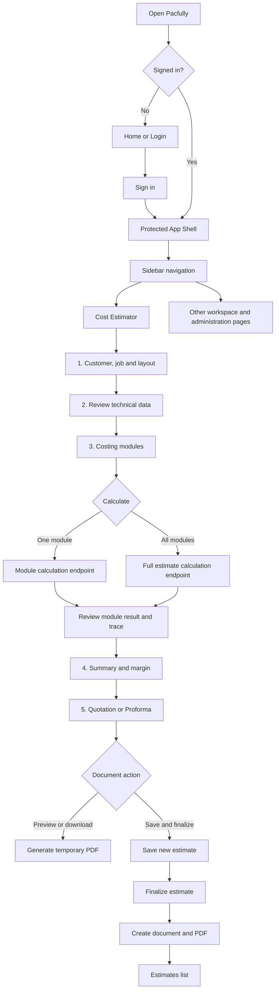

# Pacfully UI Interface and Calculation Flow

This guide describes how a user moves through the current Pacfully Cost Estimator interface, how the sidebar and estimator modules are reached, and how the costing engine produces and stores results. It reflects the implementation in this repository, including demo-only and not-yet-configured areas.

## 1. Application at a Glance

Pacfully is a React single-page application backed by a FastAPI service and SQLite database.

```text
Browser UI (React)
  -> Sidebar / Navbar / page forms
  -> frontend/src/services/api.js or direct fetch calls
  -> FastAPI routes
  -> formula evaluator + costing calculations
  -> SQLite for saved records; PDF files for generated documents
```

The costing engine is deterministic: given the same validated inputs and active formula expressions, it returns the same calculation. A calculation preview does not itself save an estimate. Saving and finalizing are separate actions.

### End-to-end UI flow



The diagram shows the user-facing path. PDF extraction populates the shared component/process matrix and technical-data review before costing. A PDF preview/download does not save a quotation record, while Save & Finalize creates a new estimate and then persists the selected document.

## 2. Sign-In and Main Application Shell

The public routes are `/` (Home) and `/login`. Application routes are protected: a visitor who is not signed in is redirected to `/login`, and the requested page is retained for the post-login redirect.

Signed-in pages use a shared shell:

- **Sidebar:** primary route navigation, Administration links, Help Centre, signed-in user and sign-out.
- **Top bar:** breadcrumb, search, notification panel, account menu and a mobile navigation button.
- **Page content:** the selected page renders inside the shared shell.

On smaller screens, the menu button opens the sidebar and a backdrop closes it. The active sidebar entry is based on the current route; all estimator routes are represented by the Cost Estimator entry.

### Sidebar destinations

| Sidebar section | Label | Route | What it opens |
|---|---|---|---|
| Main | Dashboard | `/dashboard` | Cost intelligence overview and charts. Several dashboard figures are currently presentation/demo data. |
| Main | Cost Estimator | `/estimator/new` | Starts the five-step estimate workflow. Costing modules are reached inside Step 3, not as separate sidebar pages. |
| Main | Estimates | `/estimates` | Saved estimate list; selecting an item opens `/estimates/:id`. |
| Main | Customers | `/customers` | Customer list and customer management; a customer detail route is also registered. |
| Main | Reports | `/reports` | Reports and chart views. |
| Main | Master Configuration | `/master-config` | Shared material and process rates used as defaults. |
| Main | Formulas | `/formulas` | Supported formula expressions and their configuration. |
| Main | Quotations | `/quotations` | Saved quotation documents and PDF actions. |
| Main | Proforma | `/proforma` | Proforma invoice list and PDF actions. |
| Administration | Settings | `/settings` | Company, tax and document settings. |
| Administration | Users & Roles | `/users` | User and role management. |
| Administration | Audit Log | `/audit-log` | Recorded application events. |
| Bottom | Help Centre | External Pacfully site | Opens `https://pacfully.com/` in another tab. |

The sidebar currently renders both main and Administration links for any authenticated user; the route wrapper checks sign-in, not a per-route role permission. The top-bar search routes a search term to Estimates by default, Customers for customer/client terms, Quotations for quote terms, Reports for report terms, or Master Configuration for material/rate/process terms. The notification panel links to Audit Log. The profile menu links to Settings and sign-out.

## 3. Estimator User Journey

The new estimate screen at `/estimator/new` uses a five-step progress indicator. The current step and estimate inputs are held in frontend state while the user moves between steps.

### Step 1: Layout & Component Extraction

1. Choose an existing customer or use **Add New** to create one.
2. Enter the job name.
3. Select or drop a PDF, PNG, JPG or JPEG layout file.
4. For a PDF, the app uploads it to the authenticated layout endpoint. PyMuPDF reads native text, coordinates, table cells and vector paths; OpenCV reports raster/dieline geometry and prepares scanned pages for OCR. Tesseract is used only when native text is missing or incomplete. Optional Vision is the final fallback for unresolved component relationships.
5. Review the extracted component fields, source page, confidence and status. Explicit process YES/NO values populate the editable matrix; absent or uncertain routes remain REVIEW until confirmed.

The customer list and customer creation connect to the backend. PNG/JPG/JPEG uploads remain a manual component-entry path. PDF text and dimension labels are extracted, but drawing dimensions are not assigned to a component unless the PDF gives a reliable relationship. The generic dieline preview remains illustrative; confirm extracted measurements before costing.

### Step 2: Technical Data

This screen shows the extracted project and component values, current order data, source page/confidence, review status and the same editable component/process matrix used by Layout Review. Unknown critical inputs are marked Confirmation Required; unknown process routes remain REVIEW and do not create costing rows.

The matrix is editable here. Changes update the shared estimate state. Notes remain local UI state; dimensions and other costing inputs are entered in Step 3.

### Step 3: Costing Modules

The costing stage contains module tabs. Select a tab to open its fields, enter or review inputs, and use that module's calculate button to calculate only that module. Use **Calculate All Modules** to calculate the complete estimate before reviewing the summary.

The module selection is stored in the URL query parameter `module`, for example `/estimator/new?module=Wrapper`. Opening Step 3 without a valid module parameter starts on Base Material (internally the `Kappa` module).

| Tab shown in UI | Backend module | Main inputs and calculation behavior |
|---|---|---|
| Base Material | Kappa | Material type, GSM at 1 mm, thickness, sheet dimensions, UPS, order quantity, wastage and rate. Calculates material weight and cost. |
| Wrapper | Wrapper | GSM, UPS, sheet dimensions, wastage, make-ready sheets and rate. Produces final wrapper sheet count for dependent operations. |
| Insert | Insert | FBB, Duplex and Kappa use the base-material formula with material-specific rates. EVA/EPE/PU remain CONFIGURATION REQUIRED until their price basis is confirmed. |
| Printing | Printing | Offset/Digital method, colour configuration, sheet size, first-tier rate/override and additional rate. Uses final wrapper sheet count; Digital remains CONFIGURATION REQUIRED until configured. |
| Lamination | Lamination | Separate Method (Thermal/Cold/Dry) and Finish (Matte/Gloss/Soft Touch/Other), dimensions and estimate override. Uses only a configured Method + Finish master rate and final wrapper sheets. |
| Glue | Glue | One or more named components, each with area, GSM and rate per kg. |
| Punching | Punching | Material and machine rate. Uses order quantity except Wrapper punching, which uses final wrapper sheets. Speed and setup values come from master defaults/form inputs. |
| Embellishments | Embellishments | Type, area, rate per square inch, setup and tool-cost minimum. |
| Accessories | Accessories | One or more items with quantity per box and unit cost. |
| Conversion | Conversion | Semi Automatic, Automatic or Contract inputs use configured reference rates. FBB/Duplex/Kraft use side-pasting when Semi Automatic is selected; unsupported material/method combinations remain CONFIGURATION REQUIRED. |
| One Time Cost | One Time Cost | Tooling/die rows are created only for YES components. Punching Die uses nearest configured sheet size; Emboss/Deboss and Foil Stamp dies use configured area rates. |
| EB | EB | Remains CONFIGURATION REQUIRED because its business formula is undefined. |

The UI's per-module result panel can show total cost, cost per box, weightage, a calculation trace, and a per-sheet or per-box unit cost. Weightage for an individual calculation is only available when a full estimate result exists; otherwise it may be blank.

#### Module dependency order

The full estimate engine calculates in this order:

```text
Base Material (Kappa) ─┐
Wrapper ───────────────┼─> Printing
                       ├─> Lamination
                       └─> Wrapper-material Punching
Glue, Punching, Embellishments, Accessories, Conversion, EB
                       -> total manufacturing cost -> margin and order value
```

Wrapper final sheets are calculated as base sheets plus wastage sheets plus make-ready sheets. Printing and Lamination consume this count. Punching consumes it only when Punching Material is Wrapper; otherwise it uses order quantity. When calculating one of those dependent modules individually, calculate Wrapper first. The UI checks for current wrapper results before sending dependent module requests.

### Step 4: Summary & Margin

The summary shows each returned module's order total, cost per box and percentage of manufacturing cost, alongside a module allocation doughnut chart. The margin panel shows manufacturing cost per box, editable margin percentage, selling price per box and order value.

If calculation data is missing, the page prompts the user to calculate all modules. Changing the margin updates the displayed selling price and is included in the form data used by later saving/calculation.

### Step 5: Quotation / Proforma

Choose Quotation or Proforma Invoice, then review/edit the document number, date, customer, billing address, job description, quantity, unit price, GST, validity and terms. The page displays a customer-facing preview and can request a PDF preview or download from the backend.

The customer document contains commercial line-item pricing and tax, not internal manufacturing costs, module breakdown, rates or margin. **Save & Finalize** saves a new estimate, finalizes it, creates the selected document, and then navigates to Estimates. The quotation/proforma subtotal, GST and grand total are calculated separately from the internal cost summary.

## 4. Calculation Lifecycle and API Flow

### Preview calculation

**Calculate All Modules** sends the current full form as JSON to `POST /api/estimates/calculate`. The backend validates the payload, loads the active formula set, calculates the ten result lines, and returns totals and traces. This endpoint does not write an estimate or cost lines to the database.

An individual supported module calculation sends its module name and relevant fields to `POST /api/estimates/calculate/module`. The response contains that module's result line and trace, and Wrapper also returns its final sheet count. If an estimate ID is supplied, module recalculation can update a saved Draft's cost line and input snapshot; finalized estimates cannot be changed. The current estimator UI's calculate handlers do not normally supply an estimate ID until a draft has been saved.

### Save, finalize and generate document

| User action | Backend behavior |
|---|---|
| Calculate All Modules | Computes a preview; no persistence. |
| Save Draft | `POST /api/estimates` recalculates the full form and stores an Estimate, all module CostLines, input snapshot, and audit event with Draft status. |
| Save & Finalize | The UI calls `POST /api/estimates` to create a new estimate, calls `POST /api/estimates/{id}/finalize`, then calls `POST /api/quotations` to create the quotation/proforma and generate its PDF. |
| PDF Preview | `POST /api/quotations/preview` generates a temporary PDF from the currently edited document values; it does not create the saved quotation record. |

Current lifecycle detail: **Save & Finalize creates a new estimate**; it does not look up or update an estimate created earlier by Save Draft. Repeatedly saving a draft also creates a new estimate each time. A draft saved earlier can therefore remain separate from the estimate finalized through Step 5.

Estimate detail pages show stored summary values, module cost lines and traces, the saved input snapshot, and linked document history. Finalized estimates are treated as immutable by the module recalculation route and cannot be deleted through the estimate delete endpoint.

## 5. Formula Reference and How UI Inputs Become Cost

The UI submits raw inputs; the backend formula evaluator calculates derived values. The following are the default business equations in the current implementation. Formula Configuration can change supported expressions; this file documents the defaults, not a runtime override.

Notation: `QTY` is order quantity, `UPS` is units per sheet, `CEIL(x)` rounds up to a whole number, and `Rate` is the effective configured rate.

### Effective rates

For Kappa and Wrapper:

```text
Effective rate = Estimate override, if set
               = Master Configuration rate, otherwise
               = backend fallback rate, otherwise
```

Printing uses the selected sheet-size first-tier rate unless a master value or estimate override replaces it; the additional-sheet rate remains separate. Lamination uses the selected type's rate unless overridden. Glue rates are set on each component. Punching uses its configured machine rate and material speed/setup defaults.

### Base Material (Kappa)

```text
Effective GSM       = GSM at 1 mm x Thickness (mm)
Sheet area (m^2)    = (Sheet length (mm) / 25.4) x (Sheet width (mm) / 25.4) x 0.00064516
KG per sheet        = Sheet area x Effective GSM / 1,000
Base sheets         = CEIL(QTY / UPS)
Wastage sheets      = CEIL(Base sheets x Wastage % / 100)
Final sheets        = Base sheets + Wastage sheets
Total KG            = Final sheets x KG per sheet
Total material cost = Total KG x Effective rate per kg
Cost per box        = Total material cost / QTY
```

The sheet dimension controls display inches to the user and convert those values to millimetres for the calculation.

### Wrapper

```text
Base sheets         = CEIL(QTY / UPS)
Wastage sheets      = CEIL(Base sheets x Wastage % / 100)
Final sheets        = Base sheets + Wastage sheets + Make-ready sheets
KG per sheet        = Length (mm) x Width (mm) x GSM / 1,000,000,000
Total KG            = Final sheets x KG per sheet
Total wrapper cost  = Total KG x Effective rate per kg
Cost per box        = Total wrapper cost / QTY
```

### Printing

Printing input sheets equal final Wrapper sheets.

```text
If input sheets <= 1,000: Total = First-tier rate
Otherwise:                Total = First-tier rate + (input sheets - 1,000) x additional rate
Cost per sheet = Total / input sheets
```

Default size tiers: 15x20 has INR 1,500 first-tier and INR 0.40 additional per sheet; 20x28 has INR 3,500 and INR 0.50; 28x40 has INR 6,500 and INR 0.80. An unknown size falls back to 28x40 in the backend.

### Lamination

```text
Cost per sheet = Sheet length (in) x Sheet width (in) x Rate per 100 sq.in / 100
Total lamination cost = Cost per sheet x final Wrapper sheets
```

Default rates per 100 square inches are Thermal INR 1.10, Cold INR 0.70, Dry INR 0.80.

### Glue

For each component:

```text
Area (m^2)       = Area (sq.in) x 0.00064516
Glue KG per box  = Area (m^2) x GSM / 1,000
Component cost   = Glue KG per box x Rate per kg x QTY
Total glue cost  = Sum of component costs
Cost per box     = Total glue cost / QTY
```

### Punching

```text
Input quantity = Final Wrapper sheets, for Wrapper material; otherwise QTY
Production hrs = Input quantity / machine speed (sheets per hour)
Total cost = (Production hrs + setup hrs) x machine rate per hour
Unit cost = Total cost / applicable box or sheet count
```

Default speeds are 400 sheets/hour for Kappa, 600 for Wrapper/FBB/Duplex, and 500 for Foam/EVA/EPE; default setup is 0.5 hours. The default machine rate is INR 400/hour.

### Embellishments and Accessories

```text
Embellishment raw cost = Area (sq.in) x Rate per sq.in + Setup cost
Embellishment total   = max(raw cost, Tool Cost minimum)

Accessory total = Sum over items (quantity per box x unit cost x QTY)
Accessory cost per box = Accessory total / QTY
```

### Conversion, Finishing, Tooling and EB

Matrix-routed Conversion uses the explicit rules in `FORMULAS_final.txt` and parameters from Master Configuration:

```text
Semi Automatic Kappa:
  Machine hours = (QTY / boxes per hour) x 2
  Hourly labour = Monthly salary / (working days x hours per day)
  Total cost = Workers x Hourly labour x Machine hours

Semi Automatic FBB / Duplex / Kraft:
  Total side-pasting cost = Rate per box x QTY

Automatic Kappa:
  Machine hours = (QTY / boxes per hour) x 2
  Total cost = Machine hours x machine rate + Setup hours x 2 x setup rate

Contract:
  Total cost = Contract rate per box x QTY
```

Unsupported method/material combinations are CONFIGURATION REQUIRED. EVA/EPE/PU Insert pricing remains unconfigured because the reference's `750 for 10 mm` has no confirmed area/unit basis. EB remains CONFIGURATION REQUIRED and contributes no row unless explicitly routed; no EB formula is inferred.

Foiling uses the component area, configured rate per 100 sq.in, and configured minimum per box. Spot UV uses the configured surface rate per 100 sq.in and Wrapper final sheets. Embossing/Debossing use the configured direct cost per box. Drip-Off remains CONFIGURATION REQUIRED because the reference gives conflicting `0.9` and `0.95` rates.

Tooling is separate from process finishing. Punching Die selects the nearest configured size rate from Master Configuration. Emboss/Deboss Die and Foil Stamp Die use `Area (sq.cm) x Configured rate per sq.cm`. The rates remain editable; the tooling component must explicitly select a type and provide its size or area.

### Estimate totals and margin

```text
Total manufacturing cost = Sum of all module totals
Overall cost per box     = Total manufacturing cost / QTY
Module weightage (%)     = Module total / Total manufacturing cost x 100
                           (zero when total manufacturing cost is zero)
Selling price per box    = Cost per box / (1 - Margin % / 100)
Order value              = Selling price per box x QTY
```

The API restricts margin to at least 0 and less than 100 percent. The UI summary calculates its displayed selling price from the current editable margin and calculated manufacturing cost.

### Quotation and Proforma totals

```text
Subtotal     = Document unit price x document quantity
GST amount   = Subtotal x GST % / 100
Grand total  = Subtotal + GST amount
```

The starting document unit price is the estimate selling price per box. The user may edit document quantity, price and GST independently. The server rounds stored document totals to two decimals. Costing responses typically round totals to four decimals, while the UI commonly displays currency to two decimals.

## 6. Formula Configuration and Master Configuration

These pages control different things:

- **Master Configuration** stores default rates for materials and processes. The estimator fetches these rates when it opens and pre-fills relevant rate fields.
- **Estimate override** is a value applied to one estimate in place of the master rate; resetting it returns to the master value.
- **Formula Configuration** changes supported calculation expressions, not rates. Active expressions are applied by future calculate, save and document calculations.

The backend validates formula expressions before saving: allowed variables are limited per formula; supported arithmetic, comparisons, conditionals, and a small set of functions are evaluated through a restricted expression evaluator. Invalid expressions are rejected rather than run as arbitrary Python code. Formula changes are audited.

## 7. Calculation Trace, Validation and Result Reading

Every module line can include:

- `total_cost`: total cost for the order.
- `cost_per_box`: module order total divided by order quantity.
- `unit_cost` and `unit_label`: per-sheet or per-box value where relevant.
- `weightage_percent`: share of manufacturing total, when a total is available.
- `formula`: the expression used for the module's total.
- `trace`: labeled intermediate values used to explain the calculation.

The trace is explanatory output from the backend, not a separate calculation in the browser. Pydantic request models reject invalid inputs such as non-positive quantities/sheet dimensions, negative rates, or margin outside the supported range. Formula evaluation errors are returned as validation errors by the API and shown by the UI as an error toast/banner.

## 8. Current Implementation Notes

These distinctions matter when operating, testing, or extending the current interface:

1. PDF extraction reads explicit embedded text tables only. It does not perform AI/OCR, infer process applicability, or extract dimensions. Scanned PDFs and images require manual component entry.
2. Technical Data displays live form and matrix values. Its Notes field remains local UI state and is not persisted.
3. The same component matrix is sent to calculate, draft save and finalization; only YES process rows route into matrix-aware costing.
4. Requests without a component matrix retain the legacy ten-module calculation path for backward compatibility. The current estimator sends a matrix and returns only routed, configured module lines.
5. Insert, Conversion and One Time Cost are separate matrix-routed module lines. EVA/EPE/PU Insert price basis and EB remain CONFIGURATION REQUIRED.
6. Individual Calculate actions use the current module and component rows; Wrapper-dependent Printing, Lamination and Wrapper Punching require a usable Wrapper final-sheet result.
7. A draft save runs a fresh full calculation and stores a snapshot. Save & Finalize creates another estimate instead of finalizing an earlier saved draft.
8. Saved estimate input snapshots include the active formula expressions/version fingerprint and master-rate values/version fingerprint so later configuration changes do not alter the recorded snapshot.
9. Dashboard data is partly demonstration data, as noted in the README; do not assume every dashboard/chart value is a live aggregate from saved estimates.

## 9. Related Source Files

- Estimator steps, module forms, UI calculations and save actions: `frontend/src/pages/CostEstimator.jsx`
- Sidebar routes and active navigation: `frontend/src/components/Sidebar.jsx`
- Protected application routes and shared shell: `frontend/src/App.jsx`
- Top-bar search and account controls: `frontend/src/components/Navbar.jsx`
- API helpers: `frontend/src/services/api.js`
- Calculation endpoints, defaults, persistence and quotation totals: `backend/routes.py`
- Formula definitions and restricted evaluator: `backend/formulas.py`
- Default formula reference: `FORMULAS.txt`
